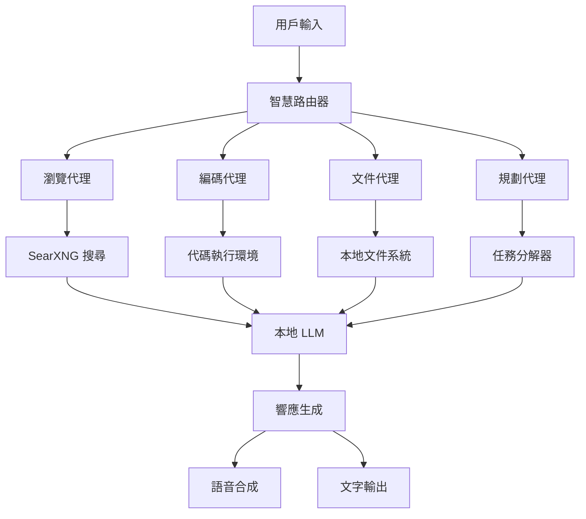

# AgenticSeek: 完全本地化的 AI 助手 🤖

<p align="center">

</p>

<p align="center">
  <strong>🔒 100% 本地化 • 🌐 智慧網頁瀏覽 • 💻 自主編碼 • 🧠 多代理協作 • 🎙️ 語音支援</strong>
</p>

<p align="center">
  English | <a href="./README_CHS.md">中文</a> | <a href="./README_CHT.md">繁體中文</a> | <a href="./README_FR.md">Français</a> | <a href="./README_JP.md">日本語</a> | <a href="./README_PTBR.md">Português (Brasil)</a>
</p>

<p align="center">
  <a href="https://fosowl.github.io/agenticSeek.html"></a>
  
  <a href="https://discord.gg/8hGDaME3TC"></a>
  <a href="https://github.com/Fosowl/agenticSeek/stargazers"></a>
</p>

---

## 🌟 核心特色

<table>
<tr>
<td width="50%">

### 🔒 **完全本地化且私密**
- ✅ 一切都在您的設備上運行
- ✅ 無需雲端，無需資料共享
- ✅ 您的文件、對話和搜尋均保持私密
- ✅ 零 API 成本，完全離線運行

### 🌐 **智慧網頁瀏覽**
- 🔍 自主搜尋和資訊擷取
- 📝 自動填寫網頁表單
- 📊 智慧內容分析和摘要
- 🔗 跨網站資訊整合

### 💻 **自主編碼助手**
- 🐍 支援 Python、C、Go、Java 等多種語言
- 🔧 自動編寫、調試和運行程序
- 📁 智慧文件管理和組織
- 🧪 完全無需監督的代碼執行

</td>
<td width="50%">

### 🧠 **智慧代理選擇**
- 🎯 自動為任務配對最合適的代理
- 👥 如同擁有一支隨時待命的專家團隊
- 🔄 多代理協作完成複雜任務
- 📈 智慧任務分解和執行

### 📋 **複雜任務規劃執行**
- ✈️ 從旅行計劃到複雜專案管理
- 📝 自動將大任務分解為可執行步驟
- 🤝 多個 AI 代理協同工作
- 📊 實時進度追蹤和報告

### 🎙️ **先進語音支援**
- 🗣️ 清晰、快速的語音合成
- 👂 準確的語音轉文字
- 🎬 科幻電影般的互動體驗
- 🌍 多語言支援

</td>
</tr>
</table>

---

## 🚀 5 分鐘快速開始

### 📦 一鍵安裝（推薦）

```bash
# 1. 克隆專案
git clone https://github.com/Fosowl/agenticSeek.git
cd agenticSeek

# 2. 運行自動安裝腳本
./install.sh  # Linux/macOS
# 或 ./install.bat  # Windows

# 3. 啟動服務
./start_services.sh

# 4. 開始使用
python3 cli.py  # 命令行模式
# 或 python3 api.py 然後訪問 http://localhost:3000  # 網頁模式
```

### 🎯 立即體驗

```bash
# 範例 1: 智慧網頁搜尋
"搜尋台北最好的咖啡廳，並將前三名保存到 taipei_cafes.txt"

# 範例 2: 自動編程
"用 Python 寫一個貪吃蛇遊戲"

# 範例 3: 複雜任務規劃
"幫我規劃一個三天的東京旅行，包括景點、美食和交通"
```

---

## 🏗️ 系統架構



---

## 📊 性能基準

| 硬體配置 | 模型大小 | 響應時間 | 任務成功率 | 推薦用途 |
|---------|---------|---------|-----------|----------|
| RTX 3060 (12GB) | 14B | 3-5秒 | 75% | 🟡 基礎任務 |
| RTX 4090 (24GB) | 32B | 2-3秒 | 90% | 🟢 大部分任務 |
| Mac Studio (48GB+) | 70B+ | 1-2秒 | 95% | 🚀 專業用途 |

---

## 🛠️ 詳細安裝指南

<details>
<summary>📋 系統需求</summary>

### 最低需求
- **作業系統**: Windows 10+, macOS 10.15+, Ubuntu 18.04+
- **記憶體**: 16GB RAM
- **顯卡**: 8GB VRAM (RTX 3060 或同等級)
- **儲存空間**: 50GB 可用空間
- **網路**: 初次下載模型需要網路連接

### 推薦配置
- **記憶體**: 32GB+ RAM
- **顯卡**: 24GB+ VRAM (RTX 4090 或同等級)
- **儲存空間**: 100GB+ SSD

</details>

<details>
<summary>🔧 手動安裝步驟</summary>

### 1. 環境準備
```bash
# 安裝 Python 3.10
python3 --version  # 確認版本

# 安裝 Docker
docker --version  # 確認安裝

# 安裝 Chrome 瀏覽器
google-chrome --version  # 確認版本
```

### 2. 專案設置
```bash
git clone https://github.com/Fosowl/agenticSeek.git
cd agenticSeek
cp .env.example .env
```

### 3. 虛擬環境
```bash
python3 -m venv agentic_seek_env
source agentic_seek_env/bin/activate  # Linux/macOS
# agentic_seek_env\Scripts\activate  # Windows
```

### 4. 依賴安裝
```bash
pip install -r requirements.txt
```

</details>

---

## ⚙️ 配置指南

<details>
<summary>📝 config.ini 詳細說明</summary>

```ini
[MAIN]
is_local = True                    # 本地運行 (True) 或遠程 API (False)
provider_name = ollama             # LLM 提供者: ollama, lm-studio, openai 等
provider_model = deepseek-r1:32b   # 模型名稱
provider_server_address = 127.0.0.1:11434  # 服務器地址
agent_name = Jarvis               # AI 助手名稱
work_dir = /path/to/workspace     # 工作目錄
languages = zh en                 # 支援語言列表

[BROWSER]
headless_browser = True           # 無頭瀏覽器模式
stealth_mode = True              # 反檢測模式
```

</details>

---

## 🎯 使用範例

<details>
<summary>💡 實用範例集合</summary>

### 🌐 網頁瀏覽任務
```
"搜尋最新的 AI 新聞，選擇三篇文章並寫成摘要保存到 ai_news.txt"
"在購物網站上搜尋最便宜的筆記型電腦，比較前五名的規格"
"註冊一個新的電子郵件帳戶並設置基本資料"
```

### 💻 編程任務
```
"用 Python 寫一個天氣查詢 API，包含錯誤處理"
"創建一個 React 組件來顯示用戶資料表格"
"寫一個 Go 程序來處理 CSV 文件並生成統計報告"
```

### 📋 複雜任務
```
"規劃一個完整的網站開發專案，包括前端、後端和資料庫設計"
"分析我的照片資料夾，按日期整理並創建相簿索引"
"研究競爭對手的產品特色，製作比較分析報告"
```

</details>

---

## 🔧 故障排除

<details>
<summary>❗ 常見問題解決</summary>

### ChromeDriver 版本不匹配
```bash
# 檢查 Chrome 版本
google-chrome --version

# 下載對應的 ChromeDriver
# 訪問: https://googlechromelabs.github.io/chrome-for-testing/
```

### 記憶體不足
```bash
# 使用較小的模型
provider_model = deepseek-r1:14b  # 而不是 32b

# 或啟用模型量化
# 在 ollama 中使用 Q4 量化版本
```

### 網路連接問題
```bash
# 檢查 Docker 服務
docker-compose ps

# 重啟服務
./start_services.sh
```

</details>

---

## 🤝 貢獻指南

我們歡迎各種形式的貢獻！

- 🐛 **報告 Bug**: [提交 Issue](https://github.com/Fosowl/agenticSeek/issues)
- 💡 **功能建議**: [討論區](https://github.com/Fosowl/agenticSeek/discussions)
- 🔧 **代碼貢獻**: [貢獻指南](./docs/CONTRIBUTING.md)
- 📖 **文檔改善**: 幫助改善文檔和範例

---

## 📈 發展路線圖

- [ ] 🐳 完整 Docker 化部署
- [ ] 🌍 更多語言支援
- [ ] 🔌 插件系統
- [ ] 📱 移動端應用
- [ ] 🔗 API 生態系統
- [ ] 🧪 高級推理能力

---

## 📞 聯繫我們

- 💬 **Discord**: [加入社群](https://discord.gg/8hGDaME3TC)
- 🐦 **Twitter**: [@Fosowl](https://x.com/Martin993886460)
- 📧 **Email**: [聯繫我們](mailto:contact@agenticseek.com)
- 🌐 **官網**: [AgenticSeek.com](https://fosowl.github.io/agenticSeek.html)

---

<p align="center">
  <strong>🌟 如果 AgenticSeek 對您有幫助，請給我們一個 Star！</strong>
</p>

<p align="center">
  <a href="https://github.com/Fosowl/agenticSeek/stargazers">
    
  </a>
</p>
